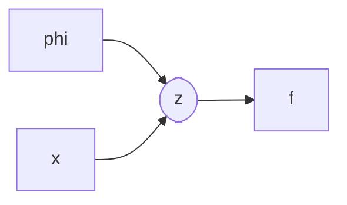

照例是要有个开头的。

我于2016年开启本科生涯，期间计算机行业大火，许多同学应声转码。那些本科选择就业的同学在大厂赚到了人生第一桶金，相传不少出色的同龄人喜提上百万年薪offer，如果行情延续至今大概也实现了前半辈子的财富自由。可惜2020年后互联网经济急转直下，再加上动荡的国际形势，AI、通信、半导体等财富密码纷纷昙花一现，身边10043的同学也难免背负时代的几粒沙。

事到如今，选择读三年硕士的各位同学在学历贬值的浪潮中几乎一无所获，拿着和当年本科毕业差不多的薪资面对怎么也不肯降一降的房价。而我在这些年的动荡中选择了鸵鸟，打算在政府资助下继续完成博士学位。在我做出决定后，OpenAI已经发布了能够取代许多劳动力甚至博士的大语言模型GPT-4，至此我也选择了彻底摆烂，一点一点地学习一些或许能派上用场的知识。


# 「 Disclaimer 」

这里变分的英文为`Variational`，与最初推导最速下降曲线的变分法`Variational Calculus`采用了相同的描述。最初的变分法将研究对象从变量升格为函数用于处理泛函分析问题[^1]，而变分推断[^2]中这种“变分”的思想体现为使用高斯分布函数族近似复杂的后验分布，解决复杂问题。这里采用变分作为名字实际上十分贴切。

此外目前中文互联网内已经有许多相似内容了，且这些内容均质化严重。本文可能会从论文本身的角度出发，尽量理解研究者的思路。

# 变分贝叶斯

> 本段中的符号定义如下:
>
> $\bf x$: 观测数据，往往被称为`证据`，`evidence`
>
> $\bf z$: 待估计参数，往往被称为`假设`，`hypothesis`

在贝叶斯统计问题中，后验概率是一个非常重要的概念。它表示我们**观测到数据$\bf x$后**对参数${\bf z} $或假设的置信度(`belief`)[^footnote1]。后验概率允许我们结合先验信息（来自先验概率）和新数据（来自似然）来形成一个对参数更综合的、更新的belief。贝叶斯推断是基于贝叶斯公式的，将新观测结果纳入原假设概率计算的方法（即更新后验概率）。推断过程如下

<div>
    $$
    \begin{equation}
    p({\bf z} \mid {\bf x}) = \frac{p({\bf x}\mid {\bf z} )p({\bf z} )}{p({\bf x})},
    \end{equation}
    $$
</div>


其中，我们称

- $p({\bf z} )$为先验概率(`a Priori`)，该概率往往在迭代开始前依据经验给出，又或是根据现有观测计算[^footnote2]，越接近实际分布则所需要的迭代更新越少；

- $p({\bf x}\mid {\bf z} )$是似然函数(`likelihood`)，代表着给定参数${\bf z} $时观测到指定数据$\bf x$的可能性；
- $p({\bf x})$往往被称为边缘概率(`Marginal`)，是数据${\bf x}$的概率，同样也被称为`evidence`。由于数据$\bf x$在本次观测中是固定的，该结果一般不会影响到贝叶斯推断过程，该数值也被视为常数，且往往在推导过程中不关注其精确数值（然而如果是需要迭代更新的贝叶斯推断过程，该数值是必须计算的）。

> 以信道估计问题为例，通常线性观测模型为
>
> <div>
>  $$
>  \begin{equation}
>  {\bf y}={\bf Ah}+{\bf n},
>  \end{equation}
>  $$
> </div>
>
> 其中$\bf A$是导频矩阵，${\bf h}$是待估计参数，${\bf n}$是观测噪声，一般建模为AWGN（或者强调为循环对称复高斯）。在估计信道${\bf h}$时，我们可以构造如下推断
>
> <div>
>  $$
>  \begin{equation}
>  p({\bf h} \mid {\bf y}) = \frac{p({\bf y}\mid {\bf h})p({\bf h})}{p({\bf y})}=\frac{ {\mathcal C}{\mathcal N}({\bf Ah},\sigma_n^2) p({\bf h}) }{ Z_0 },
>  \end{equation}
>  $$
> </div>
>
> 注意到这里的分布函数实际是矢量/矩阵中元素的联合分布，需要进行连乘$\Pi$操作，此处省略，详见[论文](https://ieeexplore.ieee.org/document/8961111/)[^kmltsp]。注意到分母中我们选择用常数替代$p({\bf y})$，原因同上述。在该问题中，由于我们往往假设分布已知（如上述复高斯分布），因此分母是可以计算的。在一些实际场景中，例如常见的图像问题中，该分布的建模就变的十分困难，因此计算该分布几乎是不可能的。
>

为了解决实际场景中后验概率分布难以计算等问题[^footnote3]，变分贝叶斯方法被提出。变分贝叶斯的思想是利用一个分布$q({\bf z} )$去近似后验分布$p({\bf z} \mid{\bf x})$，但是$q({\bf z} )$的选择依赖一些优化方法。为了衡量$q({\bf z} )$近似$p({\bf z} \mid{\bf x})$的能力，我们可以尝试计算他们的KL散度(`Kullback–Leibler Divergence`)。

<div>
    $$
    \begin{equation}
    \begin{aligned}
    D_{\rm KL}(q\| p)=& \underset{ {\bf z} }{\mathbb E}\left[ \log\left( \frac{q({\bf z} ) }{p({\bf z}  \mid{\bf x}) } \right) \right]=\sum_{ {\bf z} } q({\bf z} ) \log\left( \frac{q({\bf z} ) }{p({\bf z}  \mid{\bf x}) } \right)\\
    \overset{(a)}{=}& \sum_{ {\bf z} } q({\bf z} )\left( \log q({\bf z} ) + \log p({\bf x}) -\log p({\bf x},{\bf z} ) \right)\\
    =& \log p({\bf x}) + \sum_{ {\bf z} } q({\bf z} )\left( \log q({\bf z} ) -\log p({\bf x},{\bf z} ) \right)>0,
    \end{aligned}
    \end{equation}
    $$
</div>


其中$(a)$过程考虑到原式中的后验分布不可计算，最终由于KL散度的性质得到不等式

<div>
    $$
    \begin{equation}
    \log p({\bf x}) > \sum_{ {\bf z} } q({\bf z} )\left( \log p({\bf x},{\bf z} ) - \log q({\bf z} )  \right)
    \end{equation}
    $$
</div>

左侧是`证据`的似然函数，因此右侧得名为证据下界(`Evidence Lower BOund, ELBO`)，有时也被称为是变分下界[^variationallb]。显然如果我们想要让两个分布接近就需要优化KL散度，而由于证据为常数，因此<mark>最小化</mark>KL散度就等价为<mark>最大化</mark>证据下界，这样就避免了直接计算后验概率的问题。

> 当然计算联合分布$p({\bf z} , {\bf x})$也并非十分容易，只是相比计算后验概率有更多更便捷的方法。例如在图模型中（普通的贝叶斯图模型或者马尔科夫随机场等），联合分布通常可以表示为局部因子的乘积，这是基于条件独立性的属性，例如在贝叶斯网络中，一个节点给定其父节点是条件独立于其非后代
>
> <div>
>     $$
>     \begin{equation}
>     p({\bf z} , {\bf x})=\prod_i p\left({\bf z} _i \mid \operatorname{parents}\left({\bf z} _i\right)\right),
>     \end{equation}
>     $$
> </div>
>
> 
>
> ```mermaid
> graph TD
> 	A([A]) --> B([B])
> 	A --> C([C])
> ```
>
> 
>
> 例如在下图中，有$p(A, B, C)=p(A) \times p(B \mid A) \times p(C \mid A)$
>
> <div style="margin: auto; text-align: center">
>     <div class="mermaid"> graph TD
> 	A([A]) --> B([B])
> 	A --> C([C])
>     </div>
> </div>
>
> 此外我们还可以假设变分后验是完全独立可分解的，则
>
> <div>
>     $$
>     \begin{equation}
>     q(z)=\prod_i q_i\left(z_i\right)
>     \end{equation}
>     $$
> </div>
>
> 那么在平均场假设下更新过程中，我们可以固定所有其他节点，每次只更新其中的一个。此时的ELBO的计算就会简化。
>
> 总之，该问题的出现早于变分自编码器，也有较多的研究者对其进行了充分的研究，此处不再赘述。


# 变分自编码器

> 阅读VAE论文的过程中参考了许多中文区资料和GitHub代码，但中文社区关于ML/AI内容起步晚、同质化严重，这导致一些广为流传的错误观点大行其道。部分社区例如知乎和掘金则喜欢长篇大论地讲述错误观点，这并不利于信息的传递；GitHub社区中关于VAE的实现则十分自由，代码中出现了许多十分明显的错误。
>
> 此外在VAE论文中作者更青睐于使用$\bf z$作为隐变量的符号，这与贝叶斯推断中常用符号${\boldsymbol{\theta} } $冲突。为实现前后文统一方便阅读，此处修改了贝叶斯部分的符号使用，统一采用$\bf z$作为待推断符号。

变分自编码器是自编码器中的一个重要分支，直到今天仍有许多科研工作者在发展其理论与应用。变分问题没能解决的是，许多过程仍需要精确的闭式解，蒙特卡洛采样方法在实际使用中也不是很合适。变分自编码器的提出收到了自编码器的启发，采用可学习参数进行自编码器控制，从而使得变分分布可以通过梯度下降法直接训练，其原理是对数据做某种概率分布流形的投影。例如，我们可以将输入数据投影到高斯分布流形上，并进一步通过重参数化trick来将其恢复，对于其他常见分布，此方法一样适用。而采用神经网络的方法则可以通过数据驱动训练的方式快速得到一组合适的编解码器，尤其是在当前这种数据量爆炸的时代。下面我们简单介绍流程，并公开能够复现的代码。

首先假设需要编码的数据${\bf X}=\left\\{\mathbf{x}^{(i)}\right\\}_{i=1}^N$是独立同分布的，并且认为这些数据的生成与服从某分布的隐变量 ${\bf z} \sim p^\star({\bf z} )$有关。给定${\bf z} $后，数据的生成则可以表示为条件概率${\bf x}\sim p^\star({\bf x}\mid {\bf z} )$。

我们可以假设这些分布通过某些参数$\boldsymbol{\theta}^\star$确定，不过对参数、分布族甚至于隐变量的知识很难精确地得到。在这种场景下我们仍希望能有一种方法可以有效近似我们需要的分布，并且可以实现较为高效精确的参数估计与数据生成，甚至可以用在一些诸如计算机视觉的任务上。为此我们首先考虑引入一个模型$q_{\boldsymbol{\phi}}({\bf z} \mid {\bf x})$去近似后验分布$p_{\boldsymbol{\theta}}({\bf z} \mid {\bf x})$，优化该分布与原分布的距离就需要优化KL散度或变分下界(同公式(5))

<div>
    $$
    \begin{equation}
    \begin{aligned}
    \log p_{\boldsymbol{\theta} }({\bf x}^{(i)})\geq\mathcal{L}({\bf x}^{(i)};\boldsymbol{\phi},\boldsymbol{\theta}) & =\sum_{ {\bf z} } q_{\boldsymbol{\phi}}({\bf z} \mid {\bf x}^{(i)})\left( \log p_{\boldsymbol{\theta}}({\bf x}^{(i)},{\bf z} ) - \log q_{\boldsymbol{\phi}}({\bf z} \mid {\bf x}^{(i)}) \right)\\
    & = -D_{\rm KL}\left(q_{\boldsymbol{\phi}}\left(\mathbf{z} \mid \mathbf{x}^{(i)}\right)|| p_{\boldsymbol{\theta}}(\mathbf{z})\right)+\sum_{ {\bf z} } q_{\boldsymbol{\phi}}({\bf z} \mid {\bf x}^{(i)}) \left[\log p_{\boldsymbol{\theta}}\left(\mathbf{x}^{(i)} \mid \mathbf{z}\right)\right]\\
    & = -D_{\rm KL}\left(q_{\boldsymbol{\phi}}\left(\mathbf{z} \mid \mathbf{x}^{(i)}\right)|| p_{\boldsymbol{\theta}}(\mathbf{z})\right)+\underset{ {\bf z}\sim q_{\boldsymbol{\phi}}({\bf z} \mid {\bf x}^{(i)})}{\mathbb{E} }\left[\log p_{\boldsymbol{\theta}}\left(\mathbf{x}^{(i)} \mid \mathbf{z}\right)\right]
    \end{aligned}
    \end{equation}
    $$
</div>

上述变换是为了避免联合分布的计算问题，而最后的KL散度项往往可以有闭式表达。此时如果我们希望优化这个下界，常见的方法是蒙特卡洛(Monte Carlo)梯度估计法（该方法有较大的计算开销和估计方差），当我们对$f({\bf z})$进行梯度估计时有

<div>
    $$
    \begin{equation}
    \nabla_{\boldsymbol{\phi} } \underset{ {\bf z}\sim q_{\boldsymbol{\phi} }({\bf z})}{\mathbb{E} } [f(\mathbf{z})]=\underset{ {\bf z}\sim q_{\boldsymbol{\phi} }({\bf z})}{\mathbb{E} } \left[f(\mathbf{z}) \nabla_{q_\phi(\mathbf{z})} \log q_{\boldsymbol{\phi} }(\mathbf{z})\right] \simeq \frac{1}{L} \sum_{l=1}^L f(\mathbf{z}) \nabla_{q_{\boldsymbol{\phi} }\left(\mathbf{z}^{(l)}\right)} \log q_{\boldsymbol{\phi} }\left(\mathbf{z}^{(l)}\right)
	\end{equation}
    $$
</div>

其中$l = 1,\cdots,L$代表蒙特卡洛采样${\bf z}^{(l)}\sim q_{\boldsymbol{\phi} } ({\bf z}\mid {\bf x}^{(i)})$次数的index。对形如$q({\bf z})$的采样过程（例如蒙特卡洛采样）不仅十分棘手，而且不会记录梯度，这影响了梯度估计的运算复杂度和基于训练模型的梯度传递过程。因此作者提出使用一种重参数化(reparameterization)方法，让${\bf z}$能够通过一个更简单的分布$p(\epsilon)$重采样获得。如图所示，如果不经过重参数化，该梯度传递过程会受到阻碍（<mark>圆形</mark>节点梯度不可传递）[^gradientfig]






<div style="margin: auto; text-align: center">
<div class="mermaid"> graph LR
	A[phi] --> B([z])
	C[x] --> B([z])
	B --> f
</div>
</div>

而重参数化过程则可以保留梯度传递






<div style="margin: auto; text-align: center">
<div class="mermaid"> graph LR
	A[phi] --> B[z]
	C[x] --> B[z]
	D([epsilon]) --> B[z]
	B --> f
</div>
</div>

对于一个随机变量${\bf z}\sim q_{\boldsymbol{\phi} }(\mathbf{z} \mid \mathbf{x})$，我们可以将其表示成一个deterministic的变量$\mathbf{z}=g_\phi(\boldsymbol{\epsilon}, \mathbf{x})$，其中$\boldsymbol{\epsilon}$是一个辅助随机变量，其分布为$p(\boldsymbol{\epsilon})$。在此假设下，有

<div>
    $$
    \begin{equation}
    \int q_{\boldsymbol{\phi}}(\mathbf{z} \mid \mathbf{x}) f(\mathbf{z}) d \mathbf{z}=\int p(\boldsymbol{\epsilon}) f(\mathbf{z}) d \boldsymbol{\epsilon}=\int p(\boldsymbol{\epsilon}) f\left(g_\phi(\boldsymbol{\epsilon}, \mathbf{x})\right) d \boldsymbol{\epsilon},
    \end{equation}
    $$
</div>

>重参数化过程，以高斯分布为例，假设隐变量$z \sim p(z \mid x)=\mathcal{N}\left(\mu, \sigma^2\right)$，那么一个合理的重参数化过程为$z=\mu+\sigma \epsilon$，其中$\epsilon \sim \mathcal{N}\left(0, 1\right)$，则
>
><div>
>    $$
>    \begin{equation}
>    \underset{z\sim {\mathcal{N}\left(z ; \mu, \sigma^2\right)} }{\mathbb{E}}[f(z)]=\underset{\epsilon \sim {\mathcal{N}\left(\epsilon ; 0, 1\right)} }{\mathbb{E}} [f(\mu+\sigma \epsilon)] \simeq \frac{1}{L} \sum_{l=1}^L f\left(\mu+\sigma \epsilon^{(l)}\right),
>    \end{equation}
>    $$
></div>
>
>其中$\epsilon^{(l)}$是第$l$次采样。该期望是构造蒙特卡洛梯度估计的重要过程。

将重参数化带入变分下界ELBO的计算中（见公式(8)），我们得到

<div>
    $$
    \begin{equation}
    \hat{\mathcal{L} }({\bf x}^{(i)};\boldsymbol{\phi},\boldsymbol{\theta}) = -D_{K L}\left(q_{\boldsymbol{\phi}}\left(\mathbf{z} \mid \mathbf{x}^{(i)}\right)|| p_{\boldsymbol{\theta}}(\mathbf{z})\right)+\frac{1}{L} \sum_{l=1}^L\left(\log p_{\boldsymbol{\theta}}\left(\mathbf{x}^{(i)} \mid \mathbf{z}^{(i, l)}\right)\right)
    \end{equation}
    $$
</div>

该下界的优化只需要进行求导运算即可，算法流程[^variationallb]如下

<div>

</div>


---

> 很遗憾，我最终未能实现论文中所描述的结果。

我们可以将上述的分析应用于简单的变分自编码器测试。此处简单起见仅考虑MNIST数据集，用简单的自编码器架构实现变分自编码。与普通以MSE为重构指标的自编码器相比，变分自编码器的方式可以有效地控制隐变量的分布，并根据分布的特点生成容易控制的结果。

自编码器的基本架构如下

```python
class Encoder(nn.Module):
    def __init__(
        self,
        in_channels=1,
        hidden_dims=[4, 8, 16, 32],
        latent_dim=16,
        device=torch.device("cuda" if torch.cuda.is_available() else "mps"),
    ) -> None:
        super().__init__()
        # input shape [b, 1, 28, 28]
        self.latent_dim = latent_dim
        self.device = device
        self.hidden_dims = hidden_dims
        # for image processing we consider conv layers
        modules = []
        for h_dim in self.hidden_dims:
            modules.append(
                nn.Sequential(
                    nn.Conv2d(
                        in_channels,
                        out_channels=h_dim,
                        kernel_size=3,
                        stride=2,
                        padding=1,
                    ),
                    nn.BatchNorm2d(h_dim),
                    nn.LeakyReLU(),
                )
            )
            in_channels = h_dim

        self.encoder = nn.Sequential(*modules)
        self.fc_mu = nn.Linear(self.hidden_dims[-1] * 4, latent_dim)
        self.fc_var = nn.Linear(self.hidden_dims[-1] * 4, latent_dim)

    def forward(self, x: torch.Tensor) -> List[torch.Tensor]:
        o = self.encoder(x)
        o = torch.flatten(o, start_dim=1)
        mu = self.fc_mu(o)
        log_var = self.fc_var(o)
        return [mu, log_var]


class ConvBlock(nn.Module):
    def __init__(
        self, hidden_dims: List[int] = [8, 32, 16, 8], latent_dim: int = 16
    ) -> None:
        super(ConvBlock, self).__init__()
        conv_block = []
        for i in range(len(hidden_dims) - 1):
            conv_block.append(
                nn.Sequential(
                    nn.Conv2d(
                        hidden_dims[i],
                        hidden_dims[i + 1],
                        kernel_size=3,
                        stride=1,
                        padding=1,
                    ),
                    nn.BatchNorm2d(hidden_dims[i + 1]),
                    nn.LeakyReLU(),
                )
            )
        self.conv_block = nn.Sequential(*conv_block)

    def forward(self, x):
        return x + self.conv_block(x)


class Decoder(nn.Module):
    def __init__(
        self,
        hidden_dims=[8, 32, 16, 8],
        latent_dim=16,
        device=torch.device("cuda" if torch.cuda.is_available() else "mps"),
    ) -> None:
        super().__init__()
        self.latent_dim = latent_dim
        self.device = device
        self.hidden_dims = hidden_dims

        self.decoder_input = nn.Linear(latent_dim, hidden_dims[0] * 49)
        self.upsampling = nn.Upsample(scale_factor=4, mode="bilinear")
        self.conv_block1 = ConvBlock(hidden_dims, latent_dim)
        self.conv_block2 = ConvBlock(hidden_dims, latent_dim)
        self.output_layer = nn.Sequential(
            nn.Conv2d(hidden_dims[-1], out_channels=1, kernel_size=3, padding=1),
            nn.Sigmoid(),
        )

    def forward(self, z: torch.Tensor) -> List[torch.Tensor]:
        o = self.decoder_input(z)
        o = o.view(-1, self.hidden_dims[0], 7, 7)
        o = self.upsampling(o)
        o = self.conv_block1(o) + o
        o = self.conv_block2(o) + o
        o = self.output_layer(o)
        return o


class VAE(nn.Module):
    def __init__(
        self,
        encoder_hidden_dim=[4, 8, 16, 32],
        decoder_hidden_dim=[8, 32, 16, 8],
        latent_dim=16,
        device=torch.device("cuda" if torch.cuda.is_available() else "mps"),
    ) -> None:
        super().__init__()
        self.device = device
        self.latent_dim = latent_dim
        self.enc = Encoder(
            hidden_dims=encoder_hidden_dim, latent_dim=self.latent_dim
        ).to(device)
        self.dec = Decoder(
            hidden_dims=decoder_hidden_dim, latent_dim=self.latent_dim
        ).to(device)

    def reparameterize(self, mu: torch.Tensor, log_var: torch.Tensor) -> torch.Tensor:
        std = torch.exp(0.5 * log_var)
        eps = torch.randn_like(std, requires_grad=False)
        return eps * std + mu

    def loss_function(self, xhat, x, mu, log_var, kl_weight=0.0025) -> dict:
        recon_loss = F.mse_loss(xhat, x, reduction="mean")
        kld_loss = torch.mean(
            -0.5 * torch.sum(1 + log_var - mu**2 - log_var.exp(), dim=1), dim=0
        )
        loss = recon_loss + kl_weight * kld_loss
        return {
            "loss": loss,
            "recon_loss": recon_loss.detach(),
            "KLD": kld_loss.detach(),
        }

    def forward(self, x) -> List[torch.Tensor]:
        mu, log_var = self.enc(x)
        z = self.reparameterize(mu, log_var)
        xhat = self.dec(z)
        return [xhat, mu, log_var]
```

其中模型内的部分组件并不必要。在上述模型和辅助函数的作用下，我们可以采用梯度下降法直接训练VAE模型。需要注意的是，前文提到的变分下界估计实际上是两部分

<div>
    $$
    \begin{equation}
    \hat{\mathcal{L} }({\bf x}^{(i)};\boldsymbol{\phi},\boldsymbol{\theta}) = -D_{K L}\left(q_{\boldsymbol{\phi}}\left(\mathbf{z} \mid \mathbf{x}^{(i)}\right)|| p_{\boldsymbol{\theta}}(\mathbf{z})\right)+\frac{1}{L} \sum_{l=1}^L\left(\log p_{\boldsymbol{\theta}}\left(\mathbf{x}^{(i)} \mid \mathbf{z}^{(i, l)}\right)\right)
    \end{equation}
    $$
</div>
KL散度可以做右侧第一项进行优化，该目标的意义是隐变量的约束，而loss_function函数中的MSE部分则对应于后半部分对数似然函数的优化。实际上在重建问题上我们只需要保证MSE的绝对正确就能实现重建，而此处引入的KL散度项则相当于是对这个目标函数附加了正则项，从而降低过拟合、提高生成模型的生成效果。从论文给出的结果来看，重建效果并不够好，但其能够建立一个手写数字的高维度流形，使模型真正懂得“生成”一个数字而不是自回归。具体而言，VAE模型在KL散度与似然函数之间寻求平衡，任何一方占据主导地位时都会出现问题，会导致模型更倾向于生成还是重建。然而VAE的基本原理是两者的折中，因此生成质量较低，有无法避免的模糊问题。

在`latent_dim=2`的条件下，效果如图

<div>

</div>
<div style="text-align:center">双隐变量下观测到的MNIST流形</div>


鉴于本文首次提出VAE的时间是2013年，此时还没有CNN类模型的大热，残差网络结构还未正式提出，因此一个修改后的版本可以在[这里](/img/vae/vae.ipynb)下载


# 改进的生成式模型

`TBD`

## VQ-VAE


## GAN


## DDPM


# 小结


# 扩展阅读

[^1]:[变分法 Calculus of Variations, Wikipedia](https://en.wikipedia.org/wiki/Calculus_of_variations)
[^2]:[变分推断 Variational Bayesian Methods, Wikipedia](https://en.wikipedia.org/wiki/Variational_Bayesian_methods)
[^kmltsp]:[Compressive Sensing-Based Adaptive Active User Detection and Channel Estimation: Massive Access Meets Massive MIMO](https://ieeexplore.ieee.org/document/8961111/)
[^footnote1]: 在中文中，`belief`有不同的翻译。常见的等价翻译有`置信度`，`信念`等，因此有置信传播、后验传播等代表相同含义的不同翻译。为消除歧义，本文考虑强调`belief`。
[^footnote2]: 在贝叶斯推断问题中先验概率是必须的，其准确度直接关联到最终估计的准确性，但在迭代开始前我们可能对其没有任何知识。此时我们可能采用伯努利-高斯分布、拉普拉斯分布等通用分布来建模先验分布，其参数往往可以通过少量观测采用EM算法获得。有关EM算法的内容可能会在后期更新。
[^footnote3]: 实际上，在真实场景中，后验概率不仅是难以计算的，更有可能连解析形式都无法求得，只能通过蒙特卡洛采样等方法取得数值解。更进一步的，以图像编码为例，就连采样方法也因为样本空间过大而难以精确实现。
[^variationallb]:[Auto-Encoding Variational Bayes](https://arxiv.org/abs/1312.6114)
[^footnote4]: 采用高斯分布的原因并不只由于其参数少，还因为高斯分布可以通过最大熵法直接推出等。
[^gradientfig]:[重参数化图示](https://zhuanlan.zhihu.com/p/542478018)
