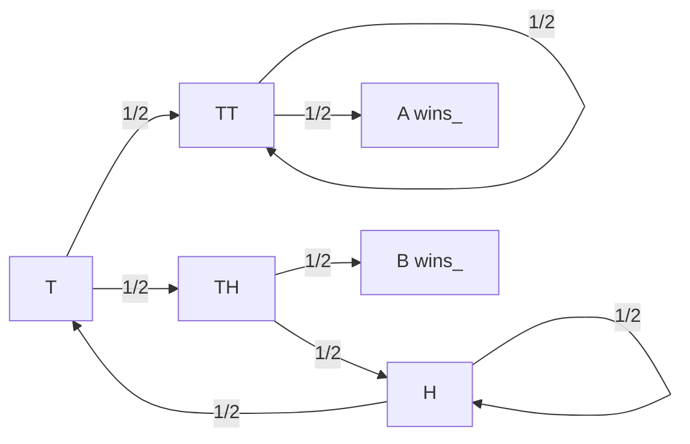

今晚的大疆DJI笔试题出现了许多有趣问题，包括但不限于`3bit每次翻转2个`。其中一个非常有趣的问题是目前较为冷门的经典博弈论问题，「硬币」游戏(Penney's Game)。题目描述如下

```
A、B 两人玩连续抛掷硬币游戏，两人依次选不同的正反pattern，然后开始连续抛掷硬币游戏，谁选择的pattern先出现谁赢。
1. 假设选定pattern的长度为1，那么A和B只能分别选择「正」或「反」，二者获胜概率相同
2. 假设选定pattern的长度为2，那么A选「正正」，B选「正反」时，谁的获胜概率大？获胜概率分别是多少？
3. 假设选定pattern的长度为3，那么A选「反反正」，B选「反正反」时，谁的获胜概率大？获胜概率分别是多少？
4. A先选「正正反」时，B是否可以通过选择pattern最大化获胜概率？概率是多少？
```

硬币游戏最早在1969年就被Walter Penney提出[^1969]，该游戏规定了最短pattern长度为$3$，而在此条件下后发玩家一定能选择一个胜率更高的pattern。从该题目的角度出发，我们可以一一解答如下

## 1. Pattern长度为1

第一次硬币抛掷就能确定胜负，各为$1/2$

## 2. Pattern长度为2

以题目要求为例，当A选择「正正」，B选择「正反」时，硬币开始投掷。当投掷结果出现「正」时，若下次的投掷结果为「正」则A胜，否则B胜，此时概率仍为各自$1/2$。

此外，若A和B各自作出了不同的选择，Pattern长度为$2$的条件下我们始终可以得出AB胜率相同的结论。这也正是该游戏采用$3$以上的长度的原因。

## 3. Pattern长度为3

值得一提的是，目前已经有相当多的[在线demo](https://penneys.github.io/)[^demo]，玩家可以自行参与仿真对比。针对题目中的情形，朴素的分析方法是马尔可夫链。构造如下状态转移，其中用`H`代表正面，用`T`代表反面






<div style="margin: auto; text-align: center">
    <div class="mermaid"> graph LR
	T-->|1/2| TT
	T-->|1/2| TH
	TT-->|1/2| TT
	TT-->|1/2| A[A wins]
	TH-->|1/2| B[B wins]
	TH-->|1/2| H
	H-->|1/2| H
	H-->|1/2| T 
    </div>
</div>
其中离开每个节点的概率和均为$1$，A和B胜利的节点均为吸收节点，进入后不再发生状态转移。根据上述描述可以确定状态转移矩阵及其稳态为

<div>
    $$
    {\bf A} = \left[\begin{matrix}
    0 & 0.5 & 0.5 & 0 & 0 & 0\\
    0 & 0.5 & 0 & 0.5 & 0 & 0\\
    0 & 0 & 0 & 0 & 0.5 & 0.5\\
    0 & 0 & 0 & 1 & 0 & 0\\
    0 & 0 & 0 & 0 & 1 & 0\\
    0.5 & 0 & 0 & 0 & 0 & 0.5
    \end{matrix}\right],\quad 
    \lim_{n\rightarrow \infty}{\bf A}^n = \left[\begin{matrix}
    0 & 0 & 0 & 2/3 & 1/3 & 0\\
    0 & 0 & 0 & 1 & 0 & 0\\
    0 & 0 & 0 & 1/3 & 2/3 & 0\\
    0 & 0 & 0 & 1 & 0 & 0\\
    0 & 0 & 0 & 0 & 1 & 0\\
    0 & 0 & 0 & 2/3 & 1/3 & 0
    \end{matrix}\right]
    $$
</div>

显然当我们以初始状态`T`进入时，A获胜的概率更高（约为$2/3$），相关结果也可以通过并不优雅的程序验证：

```matlab
clear all
close all
%%
pattern_1 = [0,0,1];
pattern_2 = [0,1,0];
win_1=0;
win_2=0;
length = 100;
implementations = 1000000;
for impl = 1:implementations
    seq = randi(2,[1,length])-1;
    for i = 1:length-2
        if seq(i) == pattern_1(1) && seq(i+1) == pattern_1(2) && seq(i+2) == pattern_1(3)
            win_1 = win_1+1;
            break
        end
        if seq(i) == pattern_2(1) && seq(i+1) == pattern_2(2) && seq(i+2) == pattern_2(3)
            win_2 = win_2+1;
            break
        end
    end
end
```

但是上述分析方法并不能指导B的方案选择。尽管我们能够在对手选定pattern后分别计算每一个pattern的稳态概率，但这样的效率并不高。由于总共只有$2^3 = 8$种方案，我们可以比较方便地提前计算胜率。以下是$3$bit条件的后手最佳胜率表格[^wiki]

| Player A | Player B | B:A Ratio |
| -------- | -------- | --------- |
| H**H**H  | **T**HH  | 7：1      |
| H**H**T  | **T**HH  | 3：1      |
| H**T**H  | **H**HT  | 2：1      |
| H**T**T  | **H**HT  | 2：1      |
| T**H**H  | **T**TH  | 2：1      |
| T**H**T  | **T**TH  | 2：1      |
| T**T**H  | **H**TT  | 3：1      |
| T**T**T  | **H**TT  | 7：1      |

该结论来自于1981年的一篇论文[^paper]，目前处于Open Access的状态。仔细观察容易发现，后手的选取均将先手pattern的前两位置于末尾。我们可以从状态机的角度去理解这个问题，当开始抛硬币的时候，模式匹配问题就进入了有限状态机迭代。


# 扩展阅读

[^1969]: Walter Penney, Problem 95. Penney-Ante, *J. Recreat. Math.*, **2** (1969), 241.
[^demo]: [Penney's Game Online](https://penneys.github.io/)
[^wiki]:[Penney's game Wikipedia](https://en.wikipedia.org/wiki/Penney%27s_game)
[^paper]:[L.J Guibas, A.M Odlyzko, String overlaps, pattern matching, and nontransitive games, *Journal of Combinatorial Theory, Series A*, vol. 30, no. 2, pp. 183-208, 1981.](https://www.sciencedirect.com/science/article/pii/0097316581900054)
